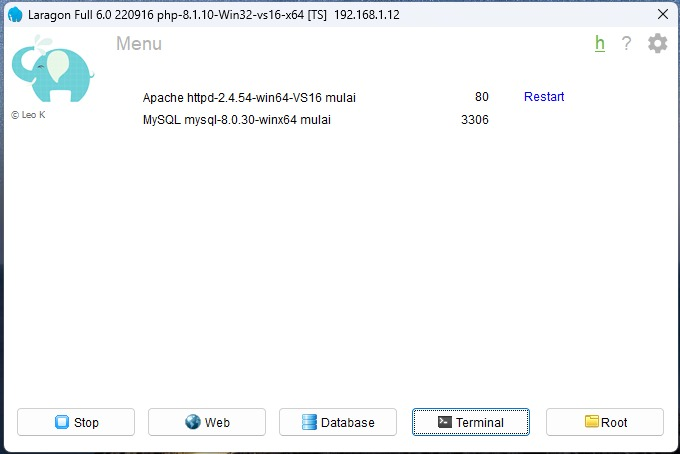
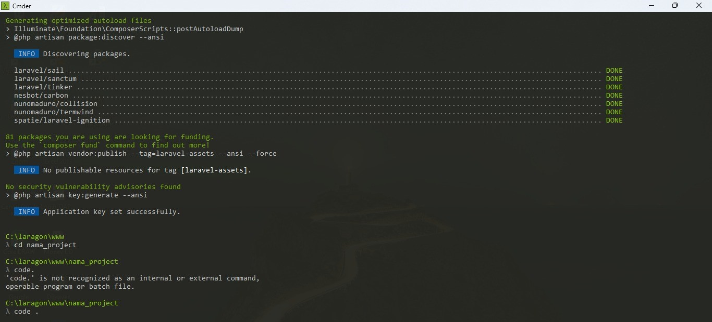
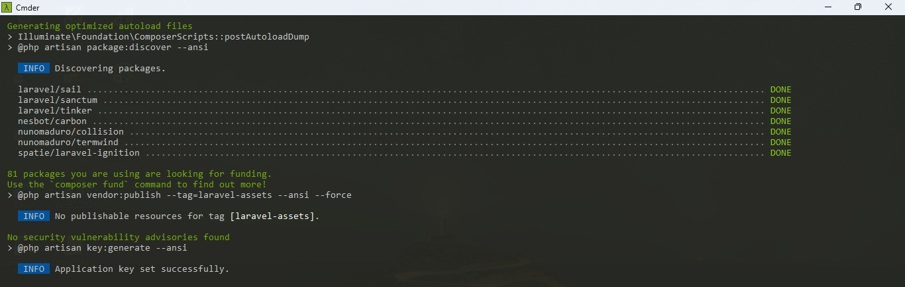
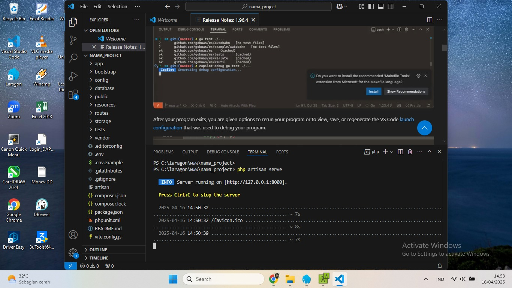

# cara-instal-laravel-menggunakan-laragon-dan-composer
1. Jalankan Laragon, lalu buka terminal

2. Download laravel (ketik prompt seperti dibawah ini)
```bash
composer create-project --prefer-dist laravel/laravel nama_project
```
Tunggu sampai selesai

3. Buka Text Editor

4. Jalankan project dengan prompt seperti dibawah ini
```bash 
php artisan serve
```

